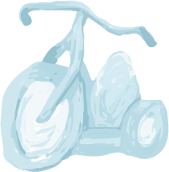

# `bigwheel`

`bigwheel` is an unopinionated, minimalist framework which handles frontend application state. It can be used to organize your application into "sections"/pages which are brought in by routes. Animation is a first class citizen and is accounted for when managing application states. `bigwheel` does not conform to a specific render engine framework so a project which is based on the DOM, WebGL, Canvas2D, SVG, or even Console applications can be built using bigwheel.

This documents purpose is to serve has an overview of how to work with bigwheel.

### Using bigwheel:
- [Quick Start](quickstart.md)

### Sections:
- [What is a section](sections.md)
- Methods of a section:
    + [init](sections-init.md)
    + [resize](sections-resize.md)
    + [animateIn](sections-animateInOut.md#animatein) and [animateOut](sections-animateInOut.md#animateout)
    + [destroy](sections-destroy.md)

### Routing:
- [What is a route](routes.md)
- [Defining routes](routes-defining.md)
    + [As section](routes-defining.md#as-section-standard-form)
    + [As section descriptor](routes-defining.md#as-section-descriptor)
    + [Multi section routes](routes-defining.md#multi-section-routes)
- [Special Routes](routes-special.md)
    + [Redirects](routes-special.md#redirects)
    + [404](routes-special.md#404)
    + [initSection](routes-special.md#initsection)

### Misc:
- [Auto resize](misc.md#auto-resize)
- [Post hash](misc.md#auto-resize)
- [Overlap](misc.md#overlap)

### Gotchas:
- [Forgetting to call done](gotchas.md#forgetting-to-call-done)
- [Circular dependendencies](gotchas.md#circular-dependendencies)
